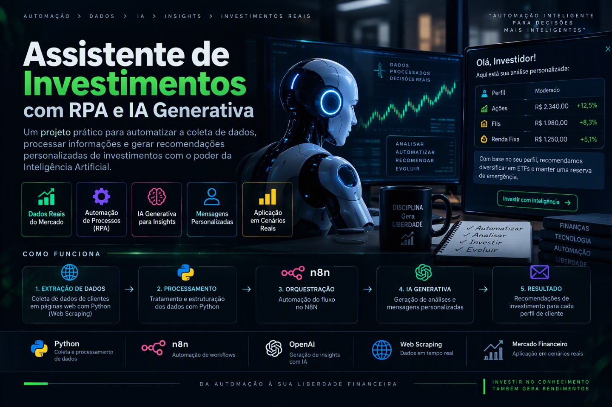

<p align="center">
  
</p>

<p align="center">
  
  
  
  
  
</p>

# Criando um Assistente de Investimentos com RPA e IA Generativa

> **AI Engineer | Especialista em Governança 4.0 e Qualidade | Engenheiro Químico**  
> [Mauá, SP](mailto:ornelas.tozato@gmail.com) | [LinkedIn](https://www.linkedin.com/in/rafaeltozato81) | [GitHub](https://github.com/Rafael-TOZATO) | [Portfólio PWA](https://tozato-dev-hub.vercel.app) | [Medium](https://medium.com/@ornelas.tozato)


## Descrição

Aprenda na prática como criar um fluxo de automação inteligente combinando técnicas de RPA (Robotic Process Automation) com workflows de IA no N8N.

Neste desafio, você vai construir um assistente de investimentos automatizado. O fluxo começa com a extração de dados de clientes em uma página web usando Python, passa pela orquestração de um workflow no N8N e termina com a geração de mensagens personalizadas para cada perfil de investidor.

O projeto foi pensado para ser simples e acessível, mesmo para quem está dando os primeiros passos em Python e automação. A ideia é que você entenda o conceito de RPA de forma leve e aplique tudo em um cenário realista do mercado financeiro.

---

## Objetivo do Projeto

Desenvolver um pipeline de automação que:

1. **Coleta dados de clientes** de uma página web simulada usando Python.
2. **Processa as informações** através de um workflow no N8N.
3. **Cruza perfis de investidor** com uma base de opções de investimento.
4. **Gera mensagens personalizadas** para cada cliente.

Ao final, você terá um sistema funcional que demonstra como empresas do setor financeiro podem automatizar a comunicação com clientes de forma inteligente.

---

## Arquitetura do Projeto

```mermaid
flowchart LR
  %% Pipeline RPA + N8N + IA (máx. 7 caixinhas)

  subgraph GH["GitHub Pages"]
    A["Clientes<br>(docs/index.html)"]
    E["Investimentos (docs/data.csv)"]
  end

  subgraph PY["RPA (Python)"]
    B["Extrair Clientes"]
  end

  subgraph N8["N8N (Workflow)"]
    C["Webhook<br>(Entrada)"]
    D["Cruzar Dados<br>(Clientes x Investimentos)"]
    M["Gerar Mensagem<br>(Template/LLM)"]
    C --> D --> M
  end

  subgraph OUT["Saída"]
    O["Mensagens Personalizadas"]
  end

  A <-->|HTTP| B --> C
  E <-->|HTTP| D
  M --> OUT

  %% Estilos
  classDef source fill:#E3F2FD,stroke:#1E88E5,stroke-width:1px,color:#0D47A1;
  classDef rpa fill:#E8F5E9,stroke:#43A047,stroke-width:1px,color:#1B5E20;
  classDef n8n fill:#FFF3E0,stroke:#FB8C00,stroke-width:1px,color:#E65100;
  classDef out fill:#FCE4EC,stroke:#D81B60,stroke-width:1px,color:#880E4F;

  class A,E source;
  class B rpa;
  class C,D,M n8n;
  class O out;
